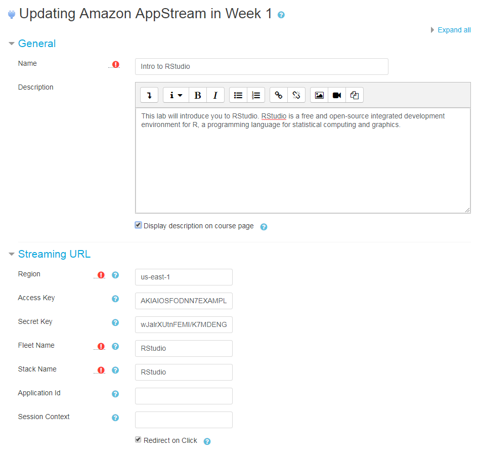

# Moodle Mod_appstream

mod_appstream is an Amazon AppStream 2.0 plugin for Moodle. The plugin allows a teacher to assign a virtual lab (e.g. R-Studio) to a student in Moodle. When the student clicks the assignment in their course, the plugin launches an AppStream instance. 

## Amazon AppStream 2.0 

Amazon AppStream 2.0 is a fully managed, secure application streaming service that allows you to stream desktop applications from AWS to any device running a web browser, without rewriting them. Amazon AppStream 2.0 can provide users instant-on access to the applications they need, with a responsive, fluid user experience on the device of their choice. You can read more about Amazon AppStream 2.0 by visiting [https://aws.amazon.com/appstream2/](https://aws.amazon.com/appstream2).

## Moodle

Moodle is a Learning Platform or course management system (CMS) - a free Open Source software package designed to help educators create effective online courses based on sound pedagogical principles. You can read more about Moodle by visiting [https://moodle.org/](https://moodle.org/)

# Installation

This module can be installed as a zip file from the Moodle administration page. There are no additional steps required.

Note: If you want to package the plugin as a zip file, Moodle expects to find a single folder in the root named appstream (i.e. not the repo name moodle-mod_appstream). If you want download the soure to a Moodle server you should copy it to /path/to/moodle/mod/appstream.

## Dependencies

mod_appstream does not depend on any other plugins. However, is does depend on the [AWS SDK for PHP](https://aws.amazon.com/sdk-for-php/). It will download the SDK as a [packaged phar](http://docs.aws.amazon.com/aws-sdk-php/v3/download/aws.phar) upon installation.

# Configuration

The AppStream plugin is configured independently for each course. There are no settings in site administration. The image below shows a typical configuration. Details follow. 



## Streaming URL

The plugin requires a Region, Fleet and Stack name configured in Amazon AppStream 2.0. In addition, you can optionally specify a Application Id and Session Context. You can read more about this in the [AppStream documentation](https://docs.aws.amazon.com/appstream2/latest/APIReference/API_CreateStreamingURL.html). 

## Authentication

This plugin supports authentication using AWS Identity and Access Management (IAM). Typically you will create [IAM user](https://docs.aws.amazon.com/IAM/latest/UserGuide/id_users.html) and and supply the Access Key and Secret Key when configuring the activity. If you are hosting Moodle on AWS, you can also use an [Instance Profile](https://docs.aws.amazon.com/IAM/latest/UserGuide/id_roles_use_switch-role-ec2_instance-profiles.html). In either case, the plugin only requires permission to call CreateStreamingURL. For example:

```
{
  "Version": "2012-10-17",
  "Statement": {
    "Effect": "Allow", 
    "Action": "appstream:CreateStreamingURL",
    "Resource": "*"
  }
}
```

The plugin does not support Single Signon (SSO). However, AppStream supports SAML based SSO. When using SSO, there is no need to call CreateStreamingURL. You can simply use the built in URL activity and set the target to your SAML IdP (e.g. Shibboleth).

## Redirect

The last option is to configure automatic redirect. When you enable this option, the plugin will redirect the user without showing the activity page (i.e. view.php). If you don't enable this option, the user will need to click the link on the activity to launch AppStream. Typically fewer clicks is better and you should enable redirect. However, if you have a long description or instructions to display on the activity page you may choose to leave it disabled.

# License

This library is licensed under the GPL 3.0 Only.
